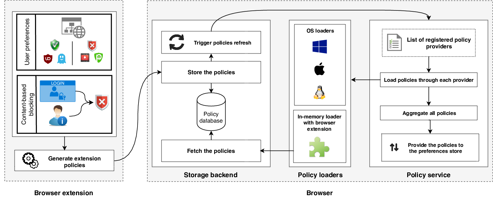

# Extension Access Control

This repository contains the code associated with the 
["Unnecessarily Identifiable: Quantifying the fingerprintability of browser extensions due to bloat"](https://www.securitee.org/files/extensionbloat_www2019.pdf) article
published at the WWW conference in 2019.

### The browser
Today, some extensions perform page modifications that do not provide any functionality to users, yet reveal the
extension’s presence to trackers and fingerprinting scripts.
To prevent what we call *extension bloat*, we directly modified Chromium to include an in-browser mechanism that provides 
coarse-grained access control for extensions on all websites. 
The proposed mechanism relies on the built-in enterprise policy feature of Chrome to protect users 
not only from fingerprinting, but also from malicious extensions exfiltrating user data from sensitive websites.
The modified browser is explained in greater details in the [published article](https://www.securitee.org/files/extensionbloat_www2019.pdf).


### The patch
The **chromium71.patch** file contains the complete list of modifications brought to Chromium. 
The patch is structured as follows:
* [From line 1 to 82](https://github.com/plaperdr/extension-access-control/blob/master/patch/chromium71.patch#L1) -
Modification of the **Storage API** to trigger a refresh of browser policies when the extension writes a new policy to storage
* [From line 83 to 195](https://github.com/plaperdr/extension-access-control/blob/master/patch/chromium71.patch#L83) -
Modifiation of the policy connector to add our own extension provider to the list of existing providers
* [From line 196 to 210](https://github.com/plaperdr/extension-access-control/blob/master/patch/chromium71.patch#L196) -
Modification of a build file of Chrome to compile our new provider and loader
* [From line 211 to 343](https://github.com/plaperdr/extension-access-control/blob/master/patch/chromium71.patch#L211) -
Files defining our own extension policy loader *ConfigExtPolicyLoader*
* [From line 344 to 448](https://github.com/plaperdr/extension-access-control/blob/master/patch/chromium71.patch#L344) -
Files defining our own extension policy provider *ConfigExtPolicyProvider* inheriting from *ConfigurationPolicyProvider*
* [From line 449 to 517](https://github.com/plaperdr/extension-access-control/blob/master/patch/chromium71.patch#L449) -
Modification of the Policy service to take into account the refresh of extension policies

The flow of our mechanism is the following:
1. When the browser launches, the browser connector creates a new extension provider in the browser that can load policies
for extension access control. This provider is added with already existing platform providers.
2. When the user interacts with the [extension](https://github.com/plaperdr/extension-access-control/tree/master/extension), 
extension policies are saved directly inside a specific browser storage.
3. When the policy is written in storage, the "RefreshPolicies" method is triggered and asks the extension provider to load 
the new version of the policy from storage.
4. When it is loaded, the Policy service will then refresh all policies. It will collect platform and extension policies,
it will merge them and transfer all of them to the preferences store where the policies will be effectively acted upon.




### The Linux prototype
You can find a fully-compiled prototype of our modified Chromium browser for x64 Linux systems 
in the _Release_ section of this repository 
[HERE](https://github.com/plaperdr/extension-access-control/releases). 
To run our modified browser, you need to follow the instructions below:
1. Download both the .deb browser file and the .zip file that contains a snapshot of this repo.
2. Run the browser. To do that, you can either:
  * Install the browser with your package manager and run it.
  * Extract the .deb file. Extract the data.tar file inside it. Execute the following command:
```
./data/opt/chromium.org/chromium/chrome
```
3.  When the browser is open, type in the URL bar:
```
chrome://extensions/
``` 
4. Click on the far right of the windown to enable "Developer mode".
5. Click on "Load unpacked" and load the folder "extension" that is in the zip file you downloaded in the first step.

The extension should appear in the tool bar on the top right of the screen! You shoud now have access to our extension 
access control mechanism!
